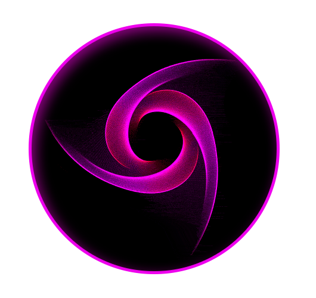

# ProPurplePink - VScode - Extension

 &nbsp;  &nbsp; 

#

  Extra extensions:
   
   <a href="https://marketplace.visualstudio.com/items?itemName=s-nlf-fh.glassit">GlassIt-VSC</a>
   Glassit: Alpha
   Transparency level 220
   
   <a href="https://marketplace.visualstudio.com/items?itemName=aladdin.aladdin-chewan-plugin">background lovely widgets</a>
   
   or
   <a href="https://marketplace.visualstudio.com/items?itemName=illixion.vscode-vibrancy-continued">Vibrancy Continued</a>

